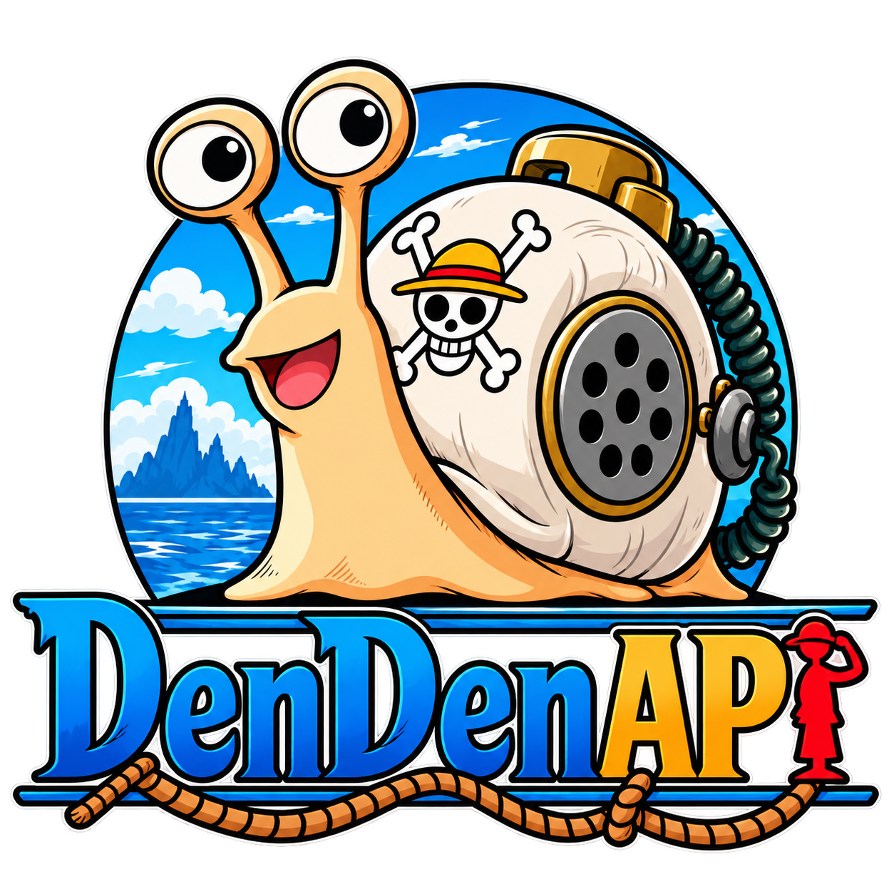

<div align="center">
  

  <h1>DenDenAPI</h1>

  <p><strong>An open, multilingual, and spoiler-aware REST API for structured One Piece data.</strong></p>

  <p>
    <a href="https://github.com/DenDenAPI/denden-api/actions/workflows/ci.yml"></a>
    <a href="LICENSE"></a>
    
    
  </p>

  <p>
    <a href="#why-dendenapi">Why DenDenAPI</a> ·
    <a href="#quick-start">Quick start</a> ·
    <a href="#architecture">Architecture</a> ·
    <a href="#documentation">Documentation</a> ·
    <a href="CONTRIBUTING.md">Contributing</a>
  </p>
</div>

> [!IMPORTANT]
> DenDenAPI is in early development. The backend foundation and domain documentation are available, but no public domain endpoint has been implemented yet.

## Why DenDenAPI?

DenDenAPI is designed as a consistent data platform rather than a wiki mirror. It combines a compact public API with a rich internal model for history, localization, spoiler safety, and source evidence.

| Principle | What it means |
| --- | --- |
| **Multilingual by design** | Clients request one language, with deterministic locale resolution and English fallback. |
| **Spoiler-aware** | Reader knowledge and fictional-world history are modeled independently. |
| **Provenance first** | Important facts retain references to official manga or supplementary sources. |
| **Stable identity** | Opaque IDs and non-localized slugs remain stable when names or translations change. |
| **Manga-first canon** | v0.1 focuses on manga canon and explicitly approved official supplementary material. |

## Project status

- [x] Initial domain model and v0.1 scope documented
- [x] Clean Architecture backend foundation
- [x] Automated build and test workflow
- [x] Open-source contribution and security policies
- [x] Domain freeze and remaining decision records
- [ ] OpenAPI contract and PostgreSQL schema
- [ ] First end-to-end domain feature

The planned v0.1 is a deliberately small vertical slice: English and Spanish responses, temporal views, spoiler caps, and official provenance over a curated dataset.

## Quick start

### Requirements

- JDK 21
- Docker with Docker Compose

### Build and test

```shell
git clone https://github.com/DenDenAPI/denden-api.git
cd denden-api
./gradlew build
./gradlew test
```

### Run with Docker

```shell
docker compose up --build
```

The API process listens on `http://localhost:8080`, and PostgreSQL is exposed locally on port `5432`. Receiving `404 Not Found` from `/` is expected until the first public endpoint is specified and implemented.

If port `8080` is already in use, select another host port:

```shell
API_PORT=8081 docker compose up --build
```

## Architecture

DenDenAPI uses Kotlin, Ktor, Metro, PostgreSQL, jOOQ, Flyway, and kotlinx.serialization. Four Gradle modules keep dependencies pointing inward:

```text
api ───────────────┐
 │                 │
 ▼                 ▼
infrastructure → application → domain
```

| Module | Responsibility |
| --- | --- |
| `domain` | Pure Kotlin business concepts and rules |
| `application` | Use cases, orchestration, and ports |
| `infrastructure` | PostgreSQL, jOOQ, Flyway, and external adapters |
| `api` | Ktor routes, JSON contracts, localization, errors, and composition |

## Documentation

| Start here | Contents |
| --- | --- |
| [`docs/domain/`](docs/domain/) | Domain model, localization, temporal rules, spoilers, and provenance |
| [`docs/architecture/`](docs/architecture/) | Architecture overview and decisions |
| [`specs/`](specs/) | Feature scope, requirements, and acceptance criteria |
| [`docs/api-design.md`](docs/api-design.md) | REST conventions and planned public API behavior |
| [`specs/api-v1-contract.md`](specs/api-v1-contract.md) | Proposed v1 API contract and review criteria |
| [`openapi/openapi.yaml`](openapi/openapi.yaml) | Proposed machine-readable v1 contract |

## Contributing

Contributions are welcome. Start with [`CONTRIBUTING.md`](CONTRIBUTING.md) and use an issue to discuss substantial domain, API, architecture, or data-model changes before implementation.

Project governance is documented in [`GOVERNANCE.md`](GOVERNANCE.md), and community participation follows the [`CODE_OF_CONDUCT.md`](CODE_OF_CONDUCT.md). Report suspected vulnerabilities privately according to [`SECURITY.md`](SECURITY.md).

## License and intellectual property

Original DenDenAPI software and documentation are licensed under the [Apache License, Version 2.0](LICENSE).

DenDenAPI is an unofficial, fan-made project and is not affiliated with or endorsed by the owners of One Piece or related intellectual property. See [`NOTICE`](NOTICE) for attribution, logo terms, and the complete third-party intellectual property disclaimer.
