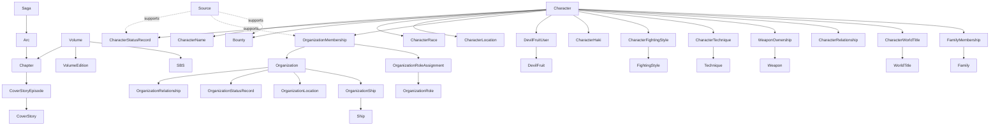

# Domain model

This is a conceptual model, not a relational schema. Names describe domain concepts; storage details, generated identifiers and join-table mechanics belong to implementation design.

## Shared conventions

First-class resources normally have:

```text
id          opaque, immutable identity
slug        unique, stable, non-localized public identifier
names       localized display content
description optional localized editorial summary
```

Historical or reveal-sensitive facts add:

```text
validFromChapter?
validToChapter?
availableFromChapter
sources[]
```

Chapter references point to `Chapter`, not bare unvalidated integers. The field names use “Chapter” because that is the public domain language.

## High-level map



## Story and publication

### Saga

```text
Saga
  id
  slug
  order
  status: ONGOING | COMPLETED
  names[]
  description?
```

Saga ordering is editorial. A saga contains ordered arcs. Chapter ranges are derived from arc/chapter membership rather than duplicated as authoritative start/end values.

### Arc

```text
Arc
  id
  slug
  sagaId
  orderWithinSaga
  status: ONGOING | COMPLETED
  names[]
  description?
```

Arc boundaries are an editorial classification, not an immutable fact stated by the manga. The API must document its chosen classification and source it as editorial metadata. In v0.1 each chapter belongs to at most one primary arc.

### Chapter

```text
Chapter
  id
  number
  arcId?
  volumeId?
  titles[]
  pageCount?
  japaneseReleaseDate?
  wsjIssue?
  coverType: STANDARD | COLOR_SPREAD | COVER_STORY | OTHER
```

`number` is unique in the main manga sequence. Special chapters require a future numbering policy rather than being coerced into decimals. Chapter title is localized. `firstMentionChapter` and `firstAppearanceChapter` on other entities refer here and remain distinct.

### Volume and VolumeEdition

```text
Volume
  id
  number
  titles[]

VolumeEdition
  id
  volumeId
  locale
  region?
  format: PAPERBACK | HARDCOVER | DIGITAL | COLORED | OTHER
  localizedTitle?
  pageCount?
  releaseDate?
  isbn?
  publisher?
```

Publication facts that vary by market belong to `VolumeEdition`, not `Volume`. A volume's chapter range is derived from chapters assigned to it.

### CoverStory and CoverStoryEpisode

```text
CoverStory
  id
  slug
  order
  names[]
  description?

CoverStoryEpisode
  id
  coverStoryId
  episodeNumber
  chapterId
  titles[]
  description?
```

Cover stories are manga-canon story content, not decorative chapter metadata. Each episode belongs to one cover story and one chapter.

### SBS

```text
SBS
  id
  volumeId
  ordinal?

SBSEntry                  deferred
  id
  sbsId
  questionSummary?
  answerSummary?
  page?
```

v0.1 needs SBS as a source reference, not full question-and-answer reproduction. Full text ingestion is out of scope and requires a copyright review.

## World entities

### Character

```text
Character
  id
  slug
  firstMentionChapterId?
  firstAppearanceChapterId?
```

Profile data, residence, occupation and status are not assumed to be timeless scalar columns.

#### CharacterName

```text
CharacterName
  id
  characterId
  type: PRIMARY | ALIAS | EPITHET
  validFromChapter?
  validToChapter?
  availableFromChapter
  translations[]
  sources[]
```

At most one primary name is active per character at a story point. Aliases and epithets remain semantically distinct.

#### CharacterStatusRecord

```text
CharacterStatusRecord
  id
  characterId
  status: ALIVE | DEAD | UNKNOWN
  validFromChapter?
  validToChapter?
  availableFromChapter
  sources[]
```

Status is historical. `Character.status` in a public response is a projection, never the source of truth.

#### Character profile history

Profile facts that can change or be revealed later use typed history rather than mutable columns:

```text
CharacterGenderRecord
  id
  characterId
  gender: MALE | FEMALE | NON_BINARY | UNKNOWN | NOT_APPLICABLE
  validFromChapter?
  validToChapter?
  availableFromChapter
  sources[]

CharacterBirthdayFact
  id
  characterId
  month
  day
  availableFromChapter
  sources[]

CharacterAgeRecord
  id
  characterId
  ageYears
  validFromChapter?
  validToChapter?
  availableFromChapter
  sources[]

CharacterHeightRecord
  id
  characterId
  heightCm
  validFromChapter?
  validToChapter?
  availableFromChapter
  sources[]
```

The gender values for v0.1 are `MALE`, `FEMALE`, `NON_BINARY`, `UNKNOWN` and `NOT_APPLICABLE`. They are editorial classifications that require official-source evidence and must never be inferred from presentation, names or appearance. `UNKNOWN` means the available official evidence explicitly leaves the value unknown or indeterminate. `NOT_APPLICABLE` means the concept does not apply to the character. The absence of a `CharacterGenderRecord` means that DenDenAPI has no recorded value; it is distinct from both enum values.

Age records avoid deriving fictional age from real release dates. Height is integer centimeters unless a future evidence model needs different precision. Additional profile fields such as blood type must be added as explicit typed concepts, not an unvalidated key/value bag.

Occupations follow the same pattern after v0.1: a localized `Occupation` taxonomy plus historical `CharacterOccupation` assignments with availability and evidence. Organization-specific ranks and positions remain `OrganizationRoleAssignment`, not occupations.

#### CharacterRelationship

```text
CharacterRelationship
  id
  fromCharacterId
  toCharacterId
  type: PARENT_OF | SIBLING_OF | SPOUSE_OF | ADOPTIVE_PARENT_OF | OTHER
  validFromChapter?
  validToChapter?
  availableFromChapter
  sources[]
```

Direction and inverse behavior are defined per relationship type. Family genealogy uses this relationship; it is not approximated through organization membership.

### Race

```text
Race
  id
  slug
  parentRaceId?
  names[]
  description?

CharacterRace
  id
  characterId
  raceId
  availableFromChapter
  sources[]
```

The relationship supports mixed heritage without encoding one `raceId` on `Character`. Taxonomy and parentage are editorial and should stay conservative.

### Location

```text
Location
  id
  slug
  type
  parentLocationId?
  names[]
  description?
  firstMentionChapterId?
  firstAppearanceChapterId?
```

`parentLocationId` represents geographic containment only. Political control, residence, origin and headquarters are typed relationships and may be historical.

```text
CharacterLocation
  id
  characterId
  locationId
  type: ORIGIN | BIRTHPLACE | RESIDENCE
  validFromChapter?
  validToChapter?
  availableFromChapter
  sources[]
```

`ORIGIN` is the canonical place an official profile attributes a character to; `BIRTHPLACE` is the literal birthplace when known; `RESIDENCE` is historical. Public `origin` is a projection over `CharacterLocation`, not a location column on `Character`.

### Family

```text
Family
  id
  slug
  names[]
  description?

FamilyMembership
  familyId
  characterId
  availableFromChapter
  sources[]
```

`Family` is a genealogy/navigation concept, not an `Organization`. `CharacterRelationship` carries precise kinship. A future `FamilyOrganizationRelationship` may connect a family to an organization without merging their identities.

### WorldTitle

```text
WorldTitle
  id
  slug
  names[]
  description?

CharacterWorldTitle
  id
  characterId
  worldTitleId
  validFromChapter?
  validToChapter?
  availableFromChapter
  sources[]
```

World titles such as the Four Emperors or Seven Warlords describe changing positions, not organizations. Ordinary localized epithets still belong to `CharacterName` with type `EPITHET`.

## Organizations

### Organization

```text
Organization
  id
  slug
  type
  names[]
  description?
  firstMentionChapterId?
  firstAppearanceChapterId?
```

Initial organization types:

```text
PIRATE_CREW | PIRATE_FLEET | ALLIANCE
GOVERNMENT | MILITARY | INTELLIGENCE_AGENCY | REVOLUTIONARY
CRIMINAL | BUSINESS | SCIENTIFIC | DIVISION | OTHER
```

`Crew` is not a top-level abstraction. A pirate crew is one organization type. Families and world titles are explicitly excluded.

### OrganizationMembership

```text
OrganizationMembership
  id
  characterId
  organizationId
  validFromChapter?
  validToChapter?
  availableFromChapter
  sources[]
```

Membership states only that a character belongs directly to an organization. It does not encode role and is not duplicated up the organization hierarchy. Effective affiliations may be derived by traversing active organization relationships.

### OrganizationRole and OrganizationRoleAssignment

```text
OrganizationRole
  id
  slug
  organizationId?       null means reusable/global role definition
  type: RANK | POSITION | LEADERSHIP | SPECIAL
  hierarchyLevel?
  names[]

OrganizationRoleAssignment
  id
  membershipId
  roleId
  validFromChapter?
  validToChapter?
  availableFromChapter
  sources[]
```

Membership and role are separate because membership can continue while rank or position changes. Multiple simultaneous roles are valid, such as a rank and a base command position. Leadership is derived from active role assignments; `Organization.leaderId` is forbidden.

### OrganizationRelationship

```text
OrganizationRelationship
  id
  fromOrganizationId
  toOrganizationId
  type: SUBUNIT_OF | AFFILIATED_WITH | ALLIED_WITH |
        SUBORDINATE_TO | PREDECESSOR_OF | MERGED_INTO
  validFromChapter?
  validToChapter?
  availableFromChapter
  sources[]
```

This replaces a single `parentOrganizationId`, which cannot express alliances, subordination and historical changes. Hierarchy traversals must guard against cycles. Symmetry and transitivity are type-specific; for example `ALLIED_WITH` is symmetric but not automatically transitive.

### OrganizationStatusRecord

```text
OrganizationStatusRecord
  id
  organizationId
  status: ACTIVE | DISBANDED | DESTROYED | UNKNOWN
  validFromChapter?
  validToChapter?
  availableFromChapter
  sources[]
```

### OrganizationLocation

```text
OrganizationLocation
  id
  organizationId
  locationId
  type: HEADQUARTERS | BASE | ORIGIN | TERRITORY
  validFromChapter?
  validToChapter?
  availableFromChapter
  sources[]
```

Headquarters is historical, not a fixed field on an organization.

### Derived organization values

`memberCount` is the count of visible active direct memberships. `totalBounty` sums the visible `ACTIVE` bounty at the selected story point for each visible active direct member. `FROZEN`, `WITHDRAWN`, `UNKNOWN` and spoiler-filtered bounty records are excluded. Neither value is persisted as authoritative organization data.

## Powers and combat

### DevilFruit and DevilFruitUser

```text
DevilFruit
  id
  slug
  type: PARAMECIA | ZOAN | LOGIA | UNKNOWN
  subtype?
  names[]
  description?
  firstMentionChapterId?
  firstAppearanceChapterId?

DevilFruitUser
  id
  devilFruitId
  characterId
  validFromChapter?
  validToChapter?
  availableFromChapter
  sources[]
```

User history belongs on the relationship. Fruit names and classifications can themselves be reveal-sensitive; v0.1 must not expose a hidden canonical name through a nested resource.

### Haki

```text
CharacterHaki
  id
  characterId
  type: OBSERVATION | ARMAMENT | SUPREME_KING
  availableFromChapter
  sources[]

HakiTechnique             deferred
  id
  slug
  hakiType
  names[]
  description?
```

There is no invented `hakiLevel`. Advanced applications are future named techniques/capabilities with evidence.

### FightingStyle and Technique

```text
FightingStyle             deferred
  id
  slug
  names[]
  description?

CharacterFightingStyle    deferred
  characterId
  fightingStyleId
  availableFromChapter
  sources[]

Technique                 deferred
  id
  slug
  fightingStyleId?
  devilFruitId?
  hakiType?
  names[]
  description?

CharacterTechnique        deferred
  characterId
  techniqueId
  firstUsedChapterId?
  availableFromChapter
  sources[]
```

The shape is reserved to avoid string arrays on characters; ingestion and endpoints are not in v0.1.

## Equipment, ships and rewards

### Bounty

```text
Bounty
  id
  characterId
  amount
  currency: BERRIES
  status: ACTIVE | FROZEN | WITHDRAWN | UNKNOWN
  validFromChapter?
  validToChapter?
  availableFromChapter
  sources[]
```

A bounty is a historical fact, not `Character.bounty`. `amount` is an integer in berries. Its status has the following meaning:

- `ACTIVE`: the bounty is currently in force at the selected story point;
- `FROZEN`: enforcement is temporarily suspended while the recorded amount is retained;
- `WITHDRAWN`: the bounty has been explicitly cancelled or is no longer in force;
- `UNKNOWN`: an amount is known, but the available official evidence does not establish its status.

Status must be supported by official-source evidence and must not be inferred from a character's organization, role, disappearance or presumed death. A superseded amount ends through its validity interval; it is not automatically `WITHDRAWN`. At any story point, at most one bounty record may be current for a character.

### Weapon and WeaponOwnership

```text
Weapon                   deferred
  id
  slug
  type: SWORD | SPEAR | GUN | STAFF | AXE | CLUB | OTHER
  grade?
  makerCharacterId?
  originLocationId?
  names[]
  firstAppearanceChapterId?

WeaponOwnership          deferred
  weaponId
  characterId
  validFromChapter?
  validToChapter?
  availableFromChapter
  sources[]
```

### Ship and affiliations

```text
Ship                     deferred
  id
  slug
  type?
  class?
  names[]
  originLocationId?
  makerCharacterId?
  length?
  height?
  firstAppearanceChapterId?

OrganizationShip         deferred
  organizationId
  shipId
  validFromChapter?
  validToChapter?
  availableFromChapter
  sources[]

CharacterShip            deferred
  characterId
  shipId
  relationshipType
  validFromChapter?
  validToChapter?
  availableFromChapter
  sources[]
```

Ship status should become a historical record when the entity enters delivery scope.

## Source

```text
Source
  id
  type: MANGA_CHAPTER | SBS | VIVRE_CARD | DATABOOK | OTHER_OFFICIAL
  chapterId?
  volumeId?
  locator?
  referenceLabel?
  publicationDate?
```

Facts may have multiple sources through an evidence association. See [provenance](provenance.md).

## Key invariants

1. Stable IDs and slugs never depend on locale.
2. Current mutable facts are projections over history records.
3. A relationship's endpoints must exist and be of the declared type.
4. Single-valued historical facts cannot overlap for the same subject.
5. Role assignments cannot outlive their membership interval.
6. Derived values use the same temporal and spoiler filters as their response.
7. Direct membership is stored once; inherited/effective affiliation is derived.
8. Families, world titles and organizations remain separate concepts.
9. Important published claims require official-source evidence.
10. An absent value means unknown/not recorded, never an inferred negative unless the field explicitly defines closed-world semantics.
