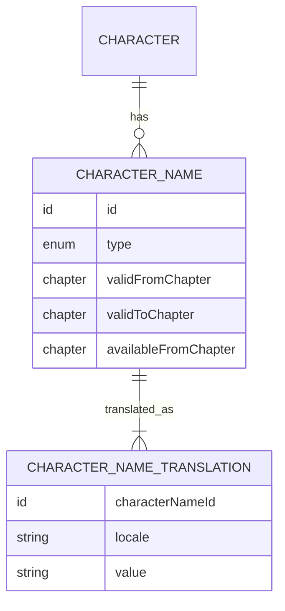

# Localization

## Decision

Localized content is stored separately from stable entity identity. The API resolves exactly one response language per request using this precedence:

1. `?lang=<language-tag>`
2. `Accept-Language`
3. English (`en`) fallback

`?lang` is an explicit override. An unsupported explicit language does not silently select an unrelated locale; the resolver attempts the defined fallback chain and reports the language actually used.

## Locale representation

Use canonical BCP 47 language tags at the API boundary, for example `en`, `es`, `es-ES` and `ja`. Matching is case-insensitive and normalized internally.

Recommended matching order for a requested tag such as `es-MX`:

1. exact supported tag, `es-MX`;
2. base language, `es`;
3. English, `en`.

Regional variants should only exist where content genuinely differs. Do not duplicate `es` into every Spanish region.

## Translation pattern

First-class entities retain non-localized fields and own one or more translation records.

```text
Entity
  id
  slug
  ...non-localized facts

EntityTranslation
  entityId
  locale
  name
  description?
```

Special concepts may use more precise structures. Character references use `CharacterName` plus `CharacterNameTranslation` because primary names, aliases and epithets have type, history and spoiler visibility.



`CharacterName.type` is one of `PRIMARY`, `ALIAS` or `EPITHET`. At most one `PRIMARY` name may be valid for a character at the same story point. Multiple aliases and epithets may coexist.

## Public response rules

- Return localized display strings, not translation maps, by default.
- Keep `id`, `slug`, enums, dates, numeric values and references language-neutral.
- Include `Content-Language` with the resolved locale.
- Include a `Vary: Accept-Language` header when the response can depend on that header.
- A response may use English for an individual missing field while the requested locale is used elsewhere. If field-level mixed fallback is allowed, it must be deterministic and documented.
- Missing optional translated content is omitted or `null`; never expose internal translation keys to public clients.

Example:

```http
GET /v1/characters/monkey-d-luffy?lang=es
```

```json
{
  "id": "char_01H...",
  "slug": "monkey-d-luffy",
  "name": "Monkey D. Luffy",
  "aliases": [],
  "epithets": ["Sombrero de Paja"]
}
```

## Japanese source text and romanization

Japanese and romanized forms are distinct localized values, not aliases invented for convenience. The exact representation can be refined during schema design, but it must support:

- original Japanese text;
- a documented romanization system;
- official or editorial translations by locale.

## Slugs

Slugs are public stable identifiers and are never translated. Changing a slug is a compatibility event. If a correction is unavoidable, preserve the old slug as a redirect/alias at the routing layer; do not treat localized names as routable identity.

## v0.1 language scope

The model supports arbitrary locales. The initial dataset must provide English for required display fields. Spanish is the first additional locale and should be present for the curated v0.1 dataset where editorially verified. Japanese source forms are recommended when reliable.
