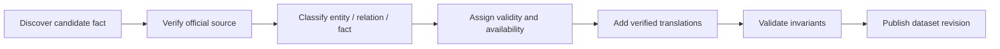

# Provenance and data governance

## Why provenance is domain data

One Piece facts are distributed across manga chapters and official supplementary material. Some facts are explicit, some are revealed later, and some sources may clarify earlier material. DenDenAPI must be able to answer not just “what do we believe?” but “which official publication supports it?”

Community wikis may help editors locate material. They are not the evidence returned by the API.

## Source model

```text
Source
  id
  type
  chapterId?
  volumeId?
  locator?
  referenceLabel?
  publicationDate?
```

Source types reserved from the start:

- `MANGA_CHAPTER`
- `SBS`
- `VIVRE_CARD`
- `DATABOOK`
- `OTHER_OFFICIAL`

A source is a bibliographic reference, not copied source content. `locator` may identify a page, card number, section or other concise location without reproducing protected text.

## Evidence associations

Important facts and relationships support `sources[]`. Conceptually this is many-to-many even if the first persistence design optimizes the common one-source case.

An evidence association may later carry:

```text
Evidence
  sourceId
  subjectType
  subjectId
  role: PRIMARY | SUPPORTING | CONTRADICTING
  editorialNote?
```

`subjectType` above is conceptual; implementation should prefer type-safe associations over an unconstrained polymorphic foreign key where practical.

Multiple sources are valuable when a supplementary source confirms a manga fact. A conflict is never resolved merely by “last write wins.”

## Source authority for v0.1

1. Manga chapters establish narrative events and reveals.
2. SBS can establish official complementary facts such as profile data.
3. Translations are editorial content and should record their translation provenance separately if licensed/official wording matters.
4. Vivre Cards and databooks are represented but their ingestion is deferred pending an explicit conflict policy.
5. Third-party summaries can create an editorial lead but cannot be published as official evidence.

## Editorial workflow

Each ingested fact should pass through:



Minimum editorial record for a spoiler-sensitive historical fact:

- subject and value;
- validity interval where known;
- `availableFromChapter`;
- at least one official source;
- editor/revision metadata at the dataset layer.

## Conflicts and corrections

When official sources conflict:

- open an editorial issue and preserve all cited evidence;
- prefer the most direct canonical evidence under the documented source policy;
- do not invent precision that the sources lack;
- expose a single public value only after an editorial resolution;
- retain the reason and superseded value in revision history.

Corrections to DenDenAPI are not fictional-world history. They belong to dataset audit metadata. Conversely, a character changing status is domain history and must be modeled with validity intervals.

## Copyright boundary

The API provides structured facts, identifiers, short labels, editorial descriptions and bibliographic locators. It must not reproduce chapter pages, long passages, complete SBS questions/answers or substantial protected text without a separate rights review.

## Dataset release metadata

Every deployment should expose machine-readable metadata containing at least:

```json
{
  "datasetVersion": "...",
  "generatedAt": "...",
  "maxIngestedChapter": 0,
  "supportedLocales": ["en", "es"]
}
```

This makes “latest” auditable and allows clients to pin or monitor data revisions independently from API software versions.
