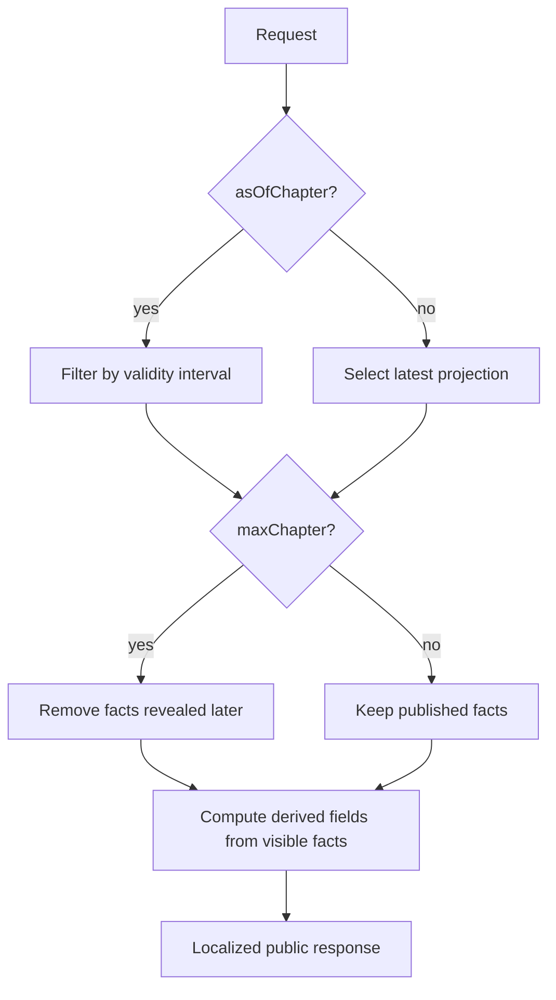

# Temporal and spoiler model

## Two independent chapter axes

DenDenAPI distinguishes fictional-world validity from reader knowledge.

| Field | Meaning |
| --- | --- |
| `validFromChapter` | First chapter at which the fact is true in the story, inclusive. |
| `validToChapter` | Last chapter at which the fact is true, inclusive; `null` means no known end. |
| `availableFromChapter` | First chapter after which exposing the fact is not a spoiler, inclusive. |

`validFromChapter` and `validToChapter` may be unknown when chronology cannot be mapped precisely. `availableFromChapter` is required for spoiler-sensitive facts exposed by v0.1.

Facts first published in SBS or another official supplement still use the manga chapter axis for spoiler filtering. Editors assign the earliest chapter boundary at which the supplementary fact is considered safely available (normally aligned to the containing volume's published chapter range) while the `Source` preserves where it was actually published. The mapping policy must be deterministic and recorded in dataset guidance.

Example: an event happens in chapter 500 but is revealed in chapter 520.

```text
validFromChapter = 500
validToChapter = null
availableFromChapter = 520
```

The fact is already true for an `asOfChapter=510` world view, but must be hidden from a reader with `maxChapter=510`.

## Request controls

- `asOfChapter=N` selects the state of the fictional world at chapter `N`.
- `maxChapter=N` caps reader-visible knowledge at chapter `N`.
- Omitting `asOfChapter` uses the dataset's maximum ingested chapter as the story point.
- Omitting `maxChapter` uses the dataset's maximum ingested chapter as the reader-knowledge cap.
- Omitting both therefore returns the latest known, published view in the current dataset.
- Supplying both applies both filters; neither parameter weakens the other.

For a temporally valid, spoiler-sensitive fact `f`, inclusion is conceptually:

```text
(f.validFromChapter is null OR f.validFromChapter <= effectiveAsOfChapter)
AND (f.validToChapter is null OR effectiveAsOfChapter <= f.validToChapter)
AND f.availableFromChapter <= effectiveMaxChapter
```

`effectiveAsOfChapter` is `asOfChapter` when supplied and the dataset's maximum ingested chapter otherwise. `effectiveMaxChapter` is `maxChapter` when supplied and the dataset's maximum ingested chapter otherwise.

Unknown validity boundaries do not mean false. They mean the API cannot use that boundary to exclude the fact. Editorial validation should prevent an unknown boundary from producing a misleading historical projection.

## Combination safety

When both parameters are supplied, `asOfChapter` may be greater than `maxChapter`, but the API must never leak knowledge later than `maxChapter`. This supports questions about a later world state while preserving a reader knowledge cap only where a safe projection exists.

If calculating a field would itself reveal filtered information, omit that field rather than return an inconsistent or inferential spoiler. Derived values such as `memberCount` and `totalBounty` must be calculated only from facts visible under the same filters.

## Applies to nested data

Temporal and spoiler filters are recursive. They apply equally to:

- names, aliases and epithets;
- character and organization statuses;
- memberships and role assignments;
- organization relationships and locations;
- bounties and world titles;
- Devil Fruit users, weapon ownership and ship affiliations;
- first appearances and other reveal-sensitive links.

An expanded relationship cannot bypass the parent request's `maxChapter`.



## Interval invariants

- Bounds are inclusive.
- `validToChapter >= validFromChapter` when both are known.
- Records for single-valued facts must not have overlapping validity intervals.
- A character may have only one active `PRIMARY` name and one active status at a story point.
- An organization membership must exist for every active role assignment attached to it.
- `availableFromChapter` must refer to a published canonical chapter and should cite the source that establishes the reveal.
- Corrections preserve audit history; they do not rewrite evidence without trace.

## Latest known view

“Current” means the newest fact supported by the API's ingested official sources, not real-world current date and not necessarily the newest chapter published globally. API metadata should expose the dataset's maximum ingested chapter so clients understand the boundary.

## Error behavior

Malformed or non-positive chapter parameters return `400`. A chapter beyond the ingested dataset also returns `400` with the supported maximum rather than pretending knowledge of unpublished data. Exact error envelopes are specified in [API design](../api-design.md).
