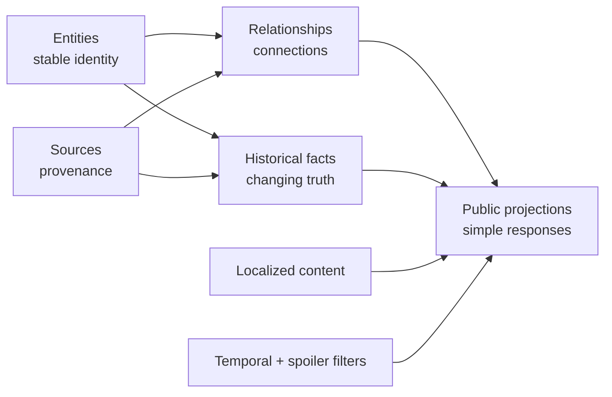

# Domain overview

## Purpose

DenDenAPI is a public, multilingual and spoiler-aware API for structured One Piece data. The first continuity is the canon of the manga. Official supplementary material such as SBS may support facts when the manga does not state them directly; every important fact retains its provenance.

The initial product is not a wiki mirror. Wiki pages can help discover the domain, but DenDenAPI owns a consistent model, stable identifiers and an explicit editorial policy.

## Domain boundary

The first bounded context contains:

- publication and story structure: sagas, arcs, chapters and volumes;
- world entities: characters, races, locations and organizations;
- selected character facts: names, status, affiliations, roles, bounties, Devil Fruits and Haki;
- localized labels and descriptions;
- historical validity, spoiler availability and source evidence.

Anime-only, film, game and other continuities are outside v0.1. The absence of a `canon` flag in every record is deliberate: the dataset is manga-canon by default. If additional continuities are introduced later, they require an explicit continuity model.

## Governing principles

### Rich internally, simple publicly

The internal model preserves history, evidence and translations. Default API responses project that model into a compact current view. Consumers request expansions only when they need them.

### Identity is not display text

Every first-class resource has an opaque internal `id` and a unique, stable, non-localized `slug`. Display names are localized content. A rename or new translation never changes identity.

### Model relationships, do not copy page fields

Membership, ownership, use and hierarchy are relationships with their own evidence and, where relevant, history. Values such as organization member count and total bounty are derived instead of stored redundantly.

### Preserve history

Facts that can change are append-only intervals, not mutable columns on their parent entity. Current state is a projection over those intervals.

### Separate story truth from reader knowledge

`validFromChapter` / `validToChapter` describe when a fact is true in the fictional timeline. `availableFromChapter` describes when the reader may learn it. These dimensions must never be conflated.

### Evidence is part of the data

Important facts and relationships point to one or more official sources. Unknown is preferable to unsourced certainty.

### Derive instead of duplicate

Ranges, counts, totals and effective affiliations are calculated from authoritative relationships whenever practical.

## Conceptual layers

| Layer | Examples |
| --- | --- |
| Entity | `Character`, `Organization`, `Location`, `Chapter` |
| Relationship | `OrganizationMembership`, `OrganizationRelationship`, `DevilFruitUser` |
| Historical fact | `CharacterStatusRecord`, `Bounty`, `OrganizationRoleAssignment` |
| Localized content | names, aliases, epithets, descriptions and role labels |
| Provenance | manga chapter, SBS volume, later official material |
| Public projection | current localized character or organization response |

## Canon and source policy

For v0.1:

1. The manga is the primary narrative authority.
2. SBS is allowed as official complementary evidence.
3. Vivre Cards, databooks and other official sources are represented by the source model but ingestion is deferred unless explicitly approved.
4. Community wikis are research aids, not authoritative provenance returned by the API.
5. Conflicts are retained as editorial issues; the API must not hide disagreement by overwriting evidence.

## Non-goals of this phase

- Choosing Ktor, PostgreSQL or a persistence schema.
- Scraping or bulk importing third-party sites.
- Publishing copyrighted chapter, SBS or databook text.
- Completing every possible One Piece entity before shipping.
- Encoding subjective power rankings or invented numeric power levels.

See [v0.1 scope and handoff](v0.1-scope.md) for the exact delivery boundary.
